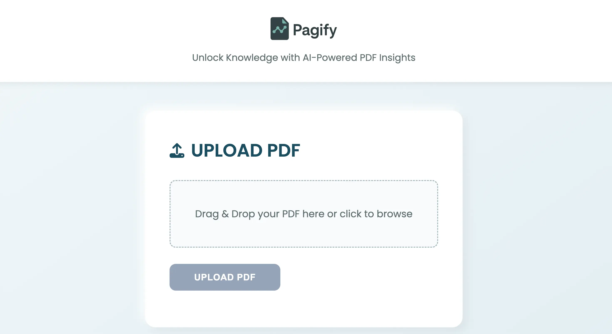

# Pagify - Next.js Edition



**Pagify** is a modern, AI-powered PDF reader built with Next.js 14, MongoDB, and Google Gemini. Upload PDFs, generate intelligent summaries, ask questions about the content, and listen to answers in Indian English using text-to-speech.

🚀 **Live Demo:** [https://pagify-two.vercel.app](https://pagify-two.vercel.app)

> "Education is the manifestation of the perfection already in man." — Swami Vivekananda

## ✨ Features

- 📄 **PDF Upload**: Upload PDFs up to 5MB and 10 pages
- 🤖 **AI Summarization**: Get concise summaries using Google Gemini
- 💬 **Question Answering**: Ask questions and get precise AI-generated answers
- 🔊 **Text-to-Speech**: Listen to summaries and answers in Indian English (`en-IN`)
- 🎨 **Modern UI**: Beautiful, responsive design with Tailwind CSS and shadcn/ui
- ⚡ **Fast Performance**: Built on Next.js 14 App Router with server-side rendering
- 📦 **MongoDB Storage**: Persistent storage of documents and summaries
- 🌐 **SEO Optimized**: Complete metadata, Open Graph, and Twitter Card support

## 🛠️ Tech Stack

- **Frontend**: Next.js 14 (App Router), React 18, TypeScript
- **Styling**: Tailwind CSS, shadcn/ui, Lucide Icons
- **Backend**: Next.js API Routes (Server Actions)
- **Database**: MongoDB with Mongoose ODM
- **AI**: Google Gemini (gemini-2.5-flash)
- **PDF Processing**: pdf-parse
- **TTS**: Web Speech API
- **Deployment**: Vercel

## 📋 Prerequisites

- Node.js 18+
- npm, yarn, or pnpm
- MongoDB Atlas account ([Sign up free](https://www.mongodb.com/cloud/atlas))
- Gemini API key ([Get one here](https://aistudio.google.com/apikey))

## 🚀 Quick Start

### 1. Clone the Repository

```bash
git clone https://github.com/aakarshtiwari26/pagify-nextjs.git
cd pagify-nextjs
```

### 2. Install Dependencies

```bash
npm install
# or
yarn install
# or
pnpm install
```

### 3. Set Up Environment Variables

Create a `.env.local` file in the root directory:

```bash
cp .env.example .env.local
```

Edit `.env.local` with your credentials:

```env
MONGODB_URI=mongodb+srv://<username>:<password>@cluster0.xxxxx.mongodb.net/pagify?retryWrites=true&w=majority
GEMINI_API_KEY=your-gemini-api-key-here
NODE_ENV=development
```

**Get MongoDB URI:**

1. Go to [MongoDB Atlas](https://www.mongodb.com/cloud/atlas)
2. Create a free cluster
3. Click "Connect" → "Connect your application"
4. Copy the connection string and replace `<username>` and `<password>`

**Get Gemini API Key:**

1. Visit [Google AI Studio](https://aistudio.google.com/apikey)
2. Create a new API key
3. Copy and paste into `.env.local`

### 4. Run Development Server

```bash
npm run dev
# or
yarn dev
# or
pnpm dev
```

Open [http://localhost:3000](http://localhost:3000) in your browser.

## 📦 Build for Production

```bash
npm run build
npm start
```

## 🚢 Deployment

### Deploy to Vercel (Recommended)

[](https://vercel.com/new/clone?repository-url=https://github.com/aakarshtiwari26/pagify-nextjs)

1. Push your code to GitHub
2. Import the repository in [Vercel](https://vercel.com)
3. Add environment variables in Vercel dashboard:
   - `MONGODB_URI`
   - `GEMINI_API_KEY`
4. Deploy!

## 📁 Project Structure

```
pagify/
├── app/
│   ├── api/
│   │   ├── upload/
│   │   │   └── route.ts       # PDF upload & processing endpoint
│   │   ├── ask/
│   │   │   └── route.ts       # Q&A endpoint
│   │   └── health/
│   │       └── route.ts       # Health check endpoint
│   ├── layout.tsx             # Root layout with metadata
│   ├── page.tsx               # Main page component
│   └── globals.css            # Global styles
├── components/
│   └── ui/
│       ├── button.tsx         # Button component
│       ├── card.tsx           # Card component
│       ├── input.tsx          # Input component
│       └── skeleton.tsx       # Skeleton loader
├── lib/
│   ├── db.ts                  # MongoDB connection
│   ├── models/
│   │   └── Document.ts        # Document schema
│   └── utils.ts               # Utility functions
├── public/
│   ├── images/                # Images and icons
│   ├── robots.txt             # SEO robots file
│   └── sitemap.xml            # SEO sitemap
├── .env.example               # Environment variables template
├── .gitignore                 # Git ignore file
├── next.config.mjs            # Next.js configuration
├── package.json               # Dependencies
├── tailwind.config.ts         # Tailwind CSS config
├── tsconfig.json              # TypeScript config
└── README.md                  # This file
```

## 🎯 Usage

1. **Upload a PDF**

   - Click or drag & drop a PDF file (max 5MB, 10 pages)
   - Wait for the AI to process and generate a summary

2. **View Summary**

   - Read the concise AI-generated summary
   - Click the speaker icon to hear it in Indian English

3. **Ask Questions**
   - Type a question about the PDF content
   - Get precise AI-generated answers
   - Listen to answers with TTS

## 🔧 API Endpoints

### POST `/api/upload`

Upload and process a PDF file.

**Request:**

- `Content-Type: multipart/form-data`
- Body: `pdf` file

**Response:**

```json
{
  "text": "Extracted text from PDF...",
  "summary": "AI-generated summary..."
}
```

### POST `/api/ask`

Ask a question about uploaded PDF content.

**Request:**

```json
{
  "question": "What is this document about?",
  "context": "Full PDF text..."
}
```

**Response:**

```json
{
  "answer": "This document is about..."
}
```

### GET `/api/health`

Health check endpoint.

**Response:**

```json
{
  "status": "healthy"
}
```

## 🎨 Customization

### Change Theme Colors

Edit `app/globals.css` to customize the color scheme:

```css
:root {
  --primary: 195 65% 25%; /* Teal blue */
  --secondary: 195 20% 90%; /* Light teal */
  /* ... more colors */
}
```

### Add More Features

- **User Authentication**: Integrate NextAuth.js
- **Document History**: Show previously uploaded PDFs
- **Export Summaries**: Add PDF/Word export functionality
- **Multi-language Support**: Add i18n with next-intl

## 🐛 Troubleshooting

### PDF Upload Fails

- Ensure file is under 5MB and 10 pages
- Check GEMINI_API_KEY is valid
- Verify MongoDB connection

### TTS Not Working

- Use Chrome for best `en-IN` voice support
- Check browser TTS permissions
- Try Firefox or Edge as alternatives

### Build Errors

- Delete `.next` folder and `node_modules`
- Run `npm install` again
- Check Node.js version (18+)

## 📄 License

MIT License © 2025 Aakarsh Tiwari

## 👨‍💻 Author

**Aakarsh Tiwari**

- LinkedIn: [linkedin.com/in/aakarshtiwari](https://www.linkedin.com/in/aakarshtiwari/)
- GitHub: [github.com/aakarshtiwari26](https://github.com/aakarshtiwari26)
- Twitter: [@aakarshtiwari08](https://twitter.com/aakarshtiwari08)

## 🙏 Acknowledgments

- [Next.js](https://nextjs.org/) - React framework
- [shadcn/ui](https://ui.shadcn.com/) - UI components
- [Google Gemini](https://ai.google.dev/) - AI models
- [MongoDB](https://www.mongodb.com/) - Database
- [Vercel](https://vercel.com/) - Deployment platform

## 🤝 Contributing

Contributions are welcome! Please:

1. Fork the repository
2. Create a feature branch (`git checkout -b feature/amazing-feature`)
3. Commit your changes (`git commit -m 'Add amazing feature'`)
4. Push to the branch (`git push origin feature/amazing-feature`)
5. Open a Pull Request

## ⭐ Support

If you like this project, please give it a ⭐ on GitHub!

---

**Made with ❤️ by Aakarsh Tiwari**
